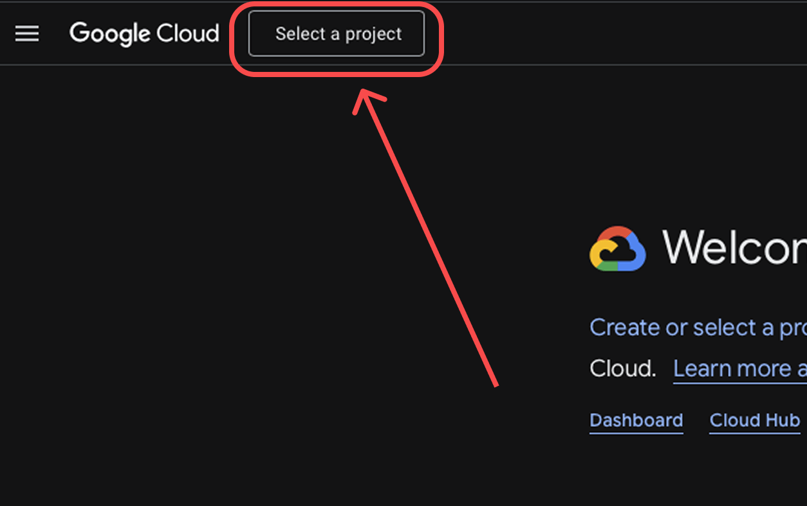

# 📊 Google Sheets to Figma Plugin

Import and sync Google Sheets data directly into Figma tables with automatic updates.

## ✨ Features

- 📥 **Import Google Sheets** — Convert spreadsheet data into Figma tables instantly
- 🔄 **Auto-update** — Refresh table data with one click
- 📑 **Multiple sheets** — Import several sheets at once
- 🌍 **Bilingual** — English and Russian interface
- 💾 **Save API key** — Store your Google API key securely in Figma

## 🚀 How to Use

### 1. Get Google API Key


*Open Google Cloud Console*

1. Open [Google Cloud Console](https://console.cloud.google.com)
2. Create a new project
3. Enable **Google Sheets API**
4. Create **API Key** in Credentials
5. Copy the key

*Detailed step-by-step tutorial with screenshots available in the plugin (click "How to get API key?")*

### 2. Prepare Your Google Sheet

- Share your sheet: **Share → Anyone with the link → Viewer**
- Copy the spreadsheet URL

### 3. Import to Figma

1. Open the plugin in Figma
2. Paste your **Google Sheets URL**
3. Paste your **API Key** and save it
4. Enter **Sheet name** (e.g., "Sheet1") or select from list
5. Click **Import table**

## 📋 Advanced Features

### Import Specific Range

You can specify a range like `A1:D10` to import only part of the sheet.

### Import Multiple Sheets

1. Click **"Select sheets"** button
2. Choose multiple sheets from the list
3. Click **"Import selected sheets"**

### Update Existing Table

1. Select a table created by this plugin
2. The plugin will auto-fill all fields
3. Click **"Update selected table"**

### Comments in Sheets

Rows starting with `//` will be ignored (treated as comments).

## 🛠 Installation for Development

```bash
# Clone the repository
git clone https://github.com/anymira/figma-sheets-plugin.git
cd figma-sheets-plugin

# Install dependencies
npm install

# Build the plugin
npm run build

# Or run in watch mode
npm run watch

Then in Figma:

Go to Plugins → Development → Import plugin from manifest
Select manifest.json from the project folder

📦 File Structure

figma-sheets-plugin/
├── manifest.json       # Plugin configuration
├── code.ts            # Plugin logic (TypeScript)
├── code.js            # Compiled plugin code
├── ui.html            # Plugin interface
├── screenshots/       # Tutorial screenshots
├── package.json
├── tsconfig.json
└── README.md

```bash

🐛 Troubleshooting

"Table is empty or no access"
Make sure your sheet is shared with "Anyone with the link"
Check that the sheet name is correct
"Error. Check key and URL"
Verify your API key is valid
Make sure Google Sheets API is enabled in your Google Cloud project
Plugin doesn't update
Try selecting the table again
Check that the spreadsheet URL matches the original

🔒 Privacy
Your API key is stored locally in Figma
No data is sent to third-party servers
The plugin only communicates with Google Sheets API
📝 License

MIT License - feel free to use and modify!

👩‍💻 Author

Created by [anymira](https://github.com/anymira)

🤝 Contributing

Issues and pull requests are welcome!

Made with ❤️ for designers who love spreadsheets
